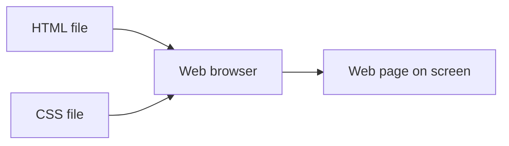
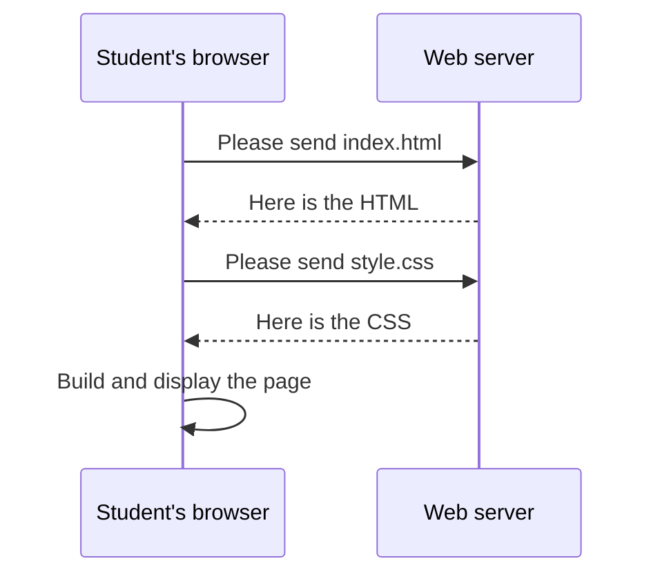
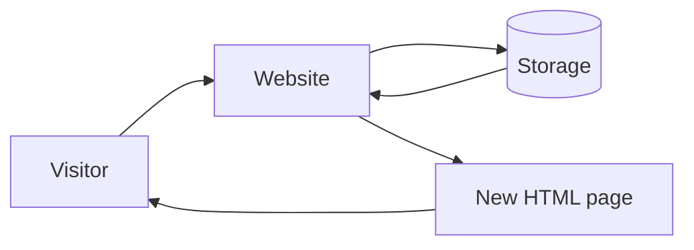
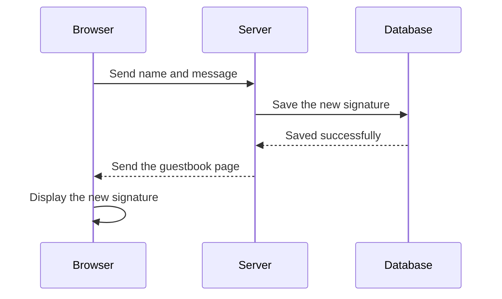
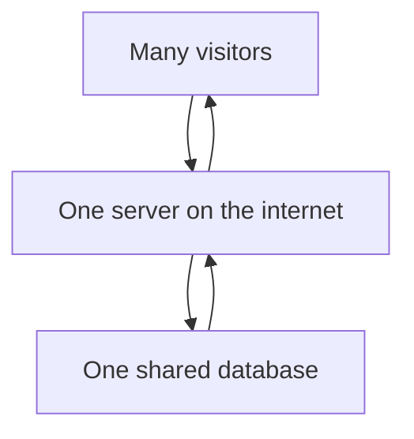
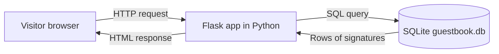
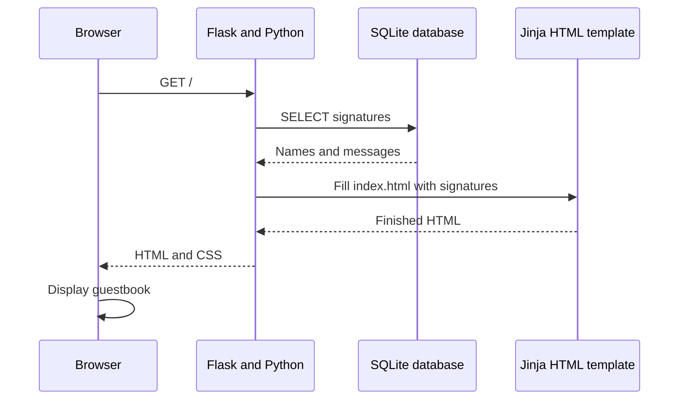
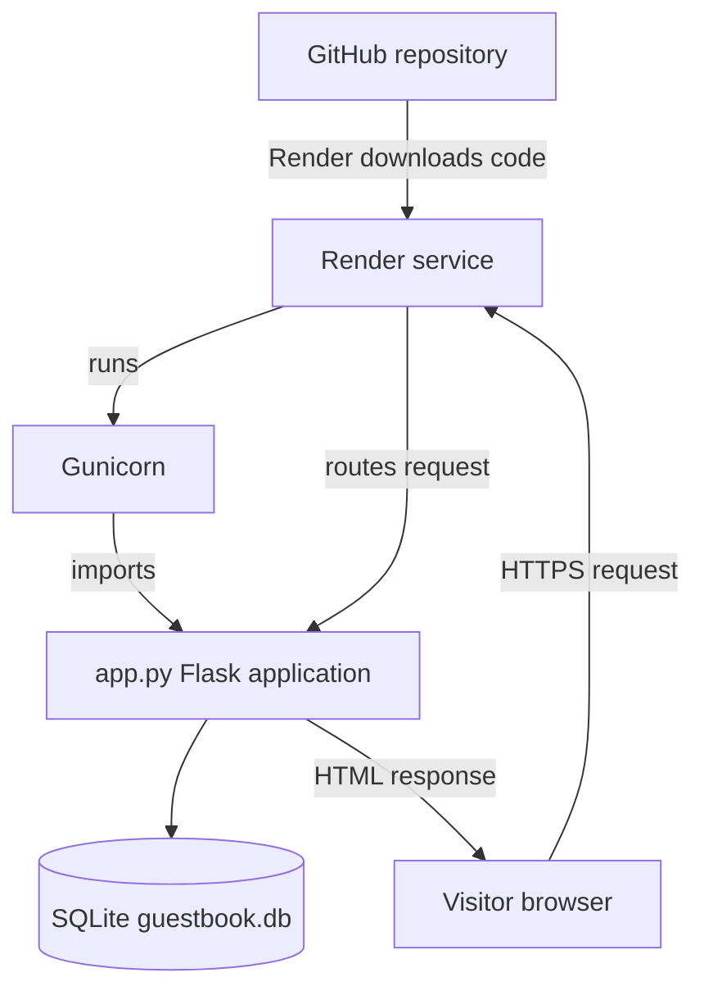

# How Websites Work

A beginner architecture lesson for our class guestbook.

## 1. Start with a Static Website

You already know the first version of a website: **HTML + CSS**.

- **HTML** describes the content: headings, paragraphs, forms, and lists.
- **CSS** describes the appearance: colors, spacing, sizes, and layout.
- The browser reads these files and draws the page on your screen.



A static website is like a printed poster. Every visitor receives the same files,
unless someone edits the files and publishes a new version.

### What happens when you visit a static site?

1. You type a web address.
2. The browser asks a web server for files.
3. The server sends back HTML and CSS.
4. The browser combines them and displays the page.



## 2. Why Do We Need Storage?

A static page cannot remember that somebody visited it. To remember information,
we need **storage**.

Examples of information a website might store:

- A guestbook name and message
- A student's score
- A shopping cart
- A login account
- A comment on a video

A website that creates or changes content using information is called a **dynamic
website**. The page can be different for different people or at different times.



For our guestbook, the important difference is:

- Static page: everyone sees a page written in advance.
- Dynamic page: the server reads saved signatures and builds the page when it is requested.

### What happens when someone signs?



## 3. Why Does Storage Need Server-Side Hosting?

The browser is on the visitor's device. If the browser saved the guestbook only
there, each visitor would have a different guestbook. One student's signature
would not be visible to anyone else.

The **server** is a computer connected to the internet that runs the website's
code. Because the server is shared, it can use one shared database for all
visitors.



Do not put secret database passwords or trusted decisions in browser code. Browser
code can be viewed and changed by the visitor. Server-side code runs on the server
and can safely control access to stored information.

### Our website's server-side tools

- **Python** is the programming language.
- **Flask** is a Python web framework. It connects web addresses to Python functions.
- **SQLite** is a small database stored in a file.
- **Gunicorn** runs the Flask application on Render.
- **Render** hosts the running server so people can visit it online.

Our database is a file named `guestbook.db`. Python uses SQL commands to create
the table, read signatures, and save new signatures.



### Important hosting note

SQLite is excellent for learning and for a small single-server project. On Render,
the normal application filesystem is temporary. To keep `guestbook.db` after a
redeploy, the service needs a Render **Persistent Disk** mounted at the database
location. A larger application may use a hosted database such as PostgreSQL
instead.

## 4. Server-Side HTML Rendering

Our browser does not receive a finished list of signatures in advance. Flask reads
the database first, then sends the data to a template.

The template is `templates/index.html`. It contains normal HTML plus Jinja template
instructions such as this loop:

```html

  <li><strong>{{ s.name }}</strong>: {{ s.message }}</li>

```

The server replaces the Jinja instructions with real HTML before sending the page.
The browser receives ordinary HTML and CSS; it does not need to know Python or SQL.



## 5. How This Website Runs on Render

Render keeps a copy of this project, installs the packages in
`requirements.txt`, and starts the application with:

```bash
gunicorn app:app
```

The first `app` means the file `app.py`. The second `app` means the Flask
application object inside that file.



### A complete visit to the current website

1. A visitor opens the Render URL.
2. Render sends the request to Gunicorn.
3. Gunicorn passes it to the Flask application in `app.py`.
4. Flask receives the `/` route request.
5. Python asks SQLite for all signatures using SQL.
6. Flask gives the results to the Jinja template.
7. Jinja produces HTML containing the signatures.
8. Flask sends the HTML to the browser.
9. The browser applies `static/style.css` and displays the page.

When the visitor submits the form, the browser sends a `POST` request to `/sign`.
Python reads the form, runs an SQL `INSERT`, and redirects the browser back to `/`.

## 6. A Simple Learning Path

### Learn Python basics

Start with variables, strings, lists, conditions, loops, and functions:

- [W3Schools Python Tutorial](https://www.w3schools.com/python/)
- [Python for Beginners](https://www.python.org/about/gettingstarted/)

Then learn the web framework used by this project:

- [Flask Quickstart](https://flask.palletsprojects.com/en/stable/quickstart/)
- [Jinja Template Designer Documentation](https://jinja.palletsprojects.com/en/stable/templates/)

### Learn SQL basics

Practice the ideas used by the guestbook: tables, rows, `SELECT`, `INSERT`, and
`WHERE`.

- [W3Schools SQL Tutorial](https://www.w3schools.com/sql/)
- [SQLBolt interactive lessons](https://sqlbolt.com/)
- [SQLite SQL language documentation](https://www.sqlite.org/lang.html)

### Learn the server-side idea

- [MDN: Server-side website programming](https://developer.mozilla.org/en-US/docs/Learn_web_development/Extensions/Server-side)
- [MDN: Introduction to the server side](https://developer.mozilla.org/en-US/docs/Learn_web_development/Extensions/Server-side/First_steps/Introduction)

## Big Idea

HTML and CSS show information. Python decides what should happen. SQL stores
information. A server connects them so many visitors can share the same website
and the same data.
